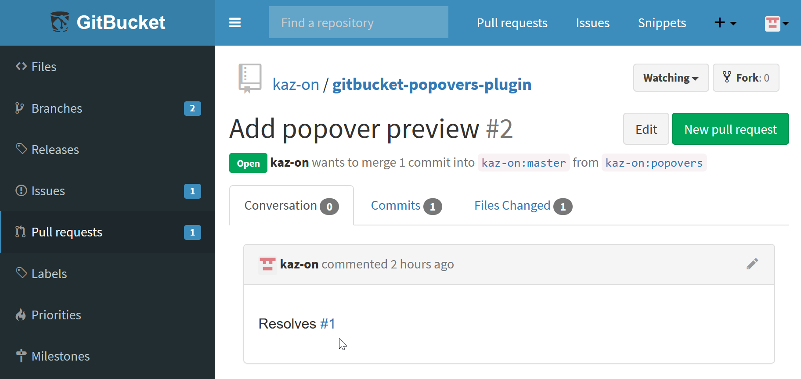

# GitBucket Popovers Plugin

This is a [GitBucket](https://gitbucket.github.io/) plugin that adds popover preview functionality for issues and pull requests.

## Features

* Show popover preview on links to issues and pull requests.
* This plugin also enables many bootstrap tooltips.

## Installation

Download jar file from the [Releases page](https://github.com/kaz-on/gitbucket-popovers-plugin/releases) and put into `GITBUCKET_HOME/plugins`.

## Operating requirements

* GitBucket 4.35.0 or later
* Web browsers that support ES2020 features  
  The latest version of Chrome, Edge or Firefox is recommended.

## Reference links to issues or pull requests not working?

GitBucket requires the correct **Base URL** setting for reference links like `#1`.  
Please check the **Base URL** under **System settings** of your GitBucket.

## Build from source

1. Install Node.js, npm, sbt, and JDK
2. Clone this repository
3. Run `npm ci`
4. Run `sbt assembly`
5. Copy `target\scala-2.13\gitbucket-popovers-plugin-x.x.x.jar` to `GITBUCKET_HOME/plugins`
